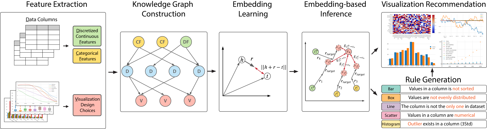

# Knowledge-Graph-4-VIS-Recommendation

 

The implementation of paper "KG4Vis: A Knowledge Graph Based Approach for Visualization Recommendation".
For more details related to this project,
please visit our [project page](https://kg4vis.github.io/index.html).

### Instruction
1. Before running it, please download the raw data [here](https://kg4vis.s3.us-east-2.amazonaws.com/corpus.zip) and extract the .csv file to ./data.
2. Extract features: ```python feature_extraction.py``` under ./feature_extraction. We also provide the extracted feature to save time. Please download [here](https://kg4vis.s3.us-east-2.amazonaws.com/feature.zip) and extract the .csv file to ./features.
3. KG construction and test generation: ```python KG_construction.py``` and ```python test_generation.py``` under ./KG_construction.
4. Embedding learning: ```./run.sh``` to run embedding learning under ./embedding_learning. To tune parameters, please modify the shell file according to the possible parameters described in ./embedding_learning/codes/run.py.
5. Inference and rule generation: ```python inference.py``` and ```python rule_generation.py``` under ./inference. The results of inference is saved under ./inference_results. (The core algorithms of inference.py and rule_generation.py are the same. To faciltate easy usage, we create two files.)

Since it is still an experimental version, please feel free to let us know if there is any issue.


### Key Package
|Name|Version
|---|---|
|python |3.7.9 |
|scikit-learn|0.21.0|
|numpy|1.16.3|
|editdistance|0.5.3|
|pandas|0.24.2|
|pytorch|1.7.0|


### Credit
We would like to thank Dr. Kevin Hu for granting us the permission of using and open-sourcing the code and dataset in [VizML](https://vizml.media.mit.edu/).

Partial implementation is based on:
- https://github.com/mitmedialab/vizml
- https://github.com/guillermo-navas-palencia/optbinning
- https://github.com/DeepGraphLearning/KnowledgeGraphEmbedding
